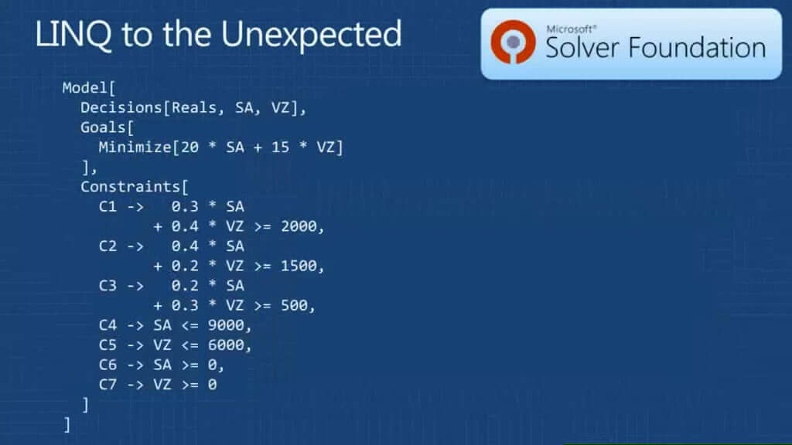

# Z3.Linq

.NET 6.0 LINQ bindings for the [Z3 theorem prover](https://github.com/Z3Prover/z3) from [Microsoft Research](https://www.microsoft.com/en-us/research/).

## Examples

A number of examples are included in this solution, which you can run [from .NET Interactive](examples/z3-problems.dib) (requires Visual Studio Code [Insiders Build](https://code.visualstudio.com/insiders/)) or [from Visual Studio](solutions/Z3.Linq.Demo/Program.cs).

### Problem - 1st Order Propositional Logic

Provide a solution where either X is true or Y is true, but not both (using a [ValueTuple](https://docs.microsoft.com/en-us/dotnet/api/system.valuetuple?view=net-6.0)).

```csharp
using (var ctx = new Z3Context())
{
    var theorem = from t in ctx.NewTheorem<(bool x, bool y)>()
                  where t.x ^ t.y
                  select t;

    var result = theorem.Solve();

    Console.WriteLine(result);
}
```

### Problem - Linear Algebra

Solve the following system with 3 variables, with linear equalities and inequalities.

```csharp
using (var ctx = new Z3Context())
{
    var theorem = from t in ctx.NewTheorem<Symbols<int, int, int>>()
                  where t.X1 - t.X2 >= 1
                  where t.X1 - t.X2 <= 3
                  where t.X1 == (2 * t.X3) + t.X2
                  select t;

    var result = theorem.Solve();

    Console.WriteLine(result);
}
```

### Problem - Price Optimised Oil Purchasing

In this example, we have two  countries that produce crude oil which we refine into three end-products: gasoline, jet fuel, and lubricant. The crude oil from each country yields different quantities of end-products once the oil is refined:

|            | Saudi Arabia  | Venezuela      |
|---         | ---           | ---            |
| Cost       | $20 / barrel  | $15 / barrel   |
| Max Order  | 9000 barrels  | 6000 barrels   |
| Refining % | 30% gasolene  | 40% gasolene   |
|            | 40% jet fuel  | 20% jet fuel   |
|            | 20% lubricant | 30% lubricant  |
|            | 10% waste     | 10% waste      |

Given we need to produce the following volume of refined end-product:

| Product   | Amount (barrels) |
| ---       | ---              |
| Gasolene  | 1900             |
| Jet Fuel  | 1500             |
| Lubricant | 500              |

 What is the most cost efficient purchase strategy of crude oil from Saudi Arabia and Venezuela?
```csharp
using (var ctx = new Z3Context())
{
    var theorem = from t in ctx.NewTheorem<(double sa, double vz)>()
                    where 0.3 * t.sa + 0.4 * t.vz >= 1900 // Gasolene
                    where 0.4 * t.sa + 0.2 * t.vz >= 1500 // Jet fuel
                    where 0.2 * t.sa + 0.3 * t.vz >= 500  // Lubricant
                    where 0 <= t.sa && t.sa <= 9000 // Max # barrels we can purchase
                    where 0 <= t.vz && t.vz <= 6000 // Max # barrels we can purchase
                    select t;

    var result = theorem.Optimize(Optimization.Minimize, t => (20.0 * t.sa) + (15.0 * t.vz)); // Optimize for cost

    Console.WriteLine($"SA: {result.sa} barrels (${result.sa * 20}), VZ: {result.vz} barrels (${result.vz * 15})");
}
```

## Getting Started

You can install the [Z3.Linq NuGet Package](https://www.nuget.org/packages/Z3.Linq/).

### For .NET Interactive

Add the package:
```
#r "nuget:Z3.Linq"
```
Then add the following using statements:

```csharp
using System;
using Microsoft.Z3;
using Z3.Linq;
```
Then you can copy any of the above samples.

### For Visual Studio

Add the `Z3.Linq` package.
Configure your application to [target x64 platform](https://docs.microsoft.com/en-us/visualstudio/ide/how-to-configure-projects-to-target-platforms?view=vs-2022). This is a requirement as `Z3.Linq` uses the [Microsoft.Z3.x64](https://www.nuget.org/packages/Microsoft.Z3.x64/) package.

## Contributing

There are a number of ways in which you could contribute to this project:

- Create new examples!
- Improve the documentation.
- Report / fix bugs.
- Suggest any implementation improvements or optimizations.
- Blog about the project!

All PRs are welcome.

## History

2009: Bart De Smet describes a prototype LINQ to Z3 binding in three blog posts:

* [LINQ to Z3 - Part 1 – Exploring The Z3 Theorem Prover](docs/blogs/part-01-exploring-the-z3-theorem-prover.md)
* [LINQ to Z3 - Part 2 – LINQ to the Unexpected](docs/blogs/part-02-linq-to-the-unexpected.md)
* [LINQ to Z3 - Part 3 – Theorem Solving On Steroids](docs/blogs/part-03-theorem-solving-on-steroids.md)

2010: Bart was [interviewed on Channel 9](https://vimeo.com/648767290) about the LINQ to Z3 concept:

[](https://vimeo.com/648767290)

2012: Bart presented [LINQ to Everything](https://vimeo.com/648776168) at TechEd Europe 2012:

[](https://vimeo.com/648776168)

2015: Z3 was open sourced under the MIT license and the [source code was moved to GitHub](https://github.com/Z3Prover/z3), where it is actively maintained.

2015: [Ricardo Niepel](https://github.com/RicardoNiepel) (Microsoft) publishes the sample as [Z3.LinqBinding](https://github.com/RicardoNiepel/Z3.LinqBinding) using `.NET 4.5` and Z3 binaries `4.4.0`

2018: [Jean-Sylvain Boige](https://github.com/jsboige) ([My Intelligence Agency](https://github.com/MyIntelligenceAgency)) adds [Missionaries And Cannibals sample](https://github.com/MyIntelligenceAgency/Z3.LinqBinding).

2020: [Karel Frajtak](https://github.com/kfrajtak) adds [support for fractions](https://github.com/kfrajtak/Z3.LinqBinding).

2021: [Howard van Rooijen](https://github.com/HowardvanRooijen) and [Ian Griffiths](https://github.com/idg10) ([endjin](https://github.com/endjin)) upgrade the project to `.NET 6.0` adding [ValueTuple](https://docs.microsoft.com/en-us/dotnet/api/system.valuetuple?view=net-6.0) support, demonstrate using `record` types, and fix nullability issues. They upgrade the solution to use [Z3 NuGet package](https://www.nuget.org/packages/Microsoft.Z3.x64/), merge in features from [Jean-Sylvain Boige](https://github.com/jsboige) and [Karel Frajtak](https://github.com/kfrajtak) forks, create archives of Bart's original blog posts and talks. They republish the project as [Z3.Linq](https://github.com/endjin/Z3.Linq), create a new [.NET Interactive Notebook](https://github.com/dotnet/interactive) of [samples](examples/z3-problems.dib), and publish a NuGet package [Z3.Linq](https://www.nuget.org/packages/Z3.Linq/).