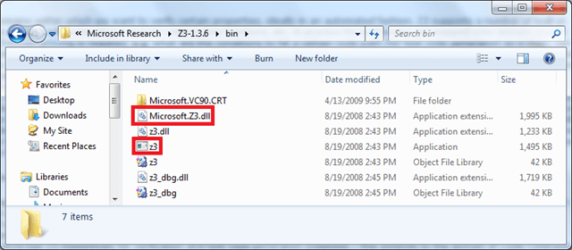
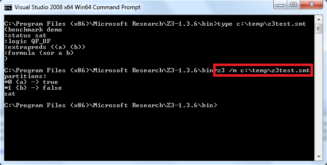
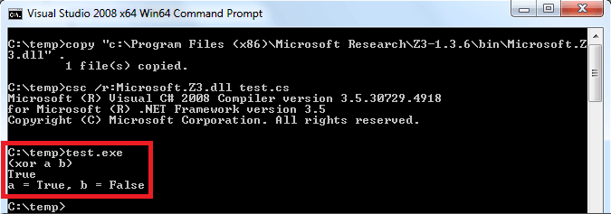
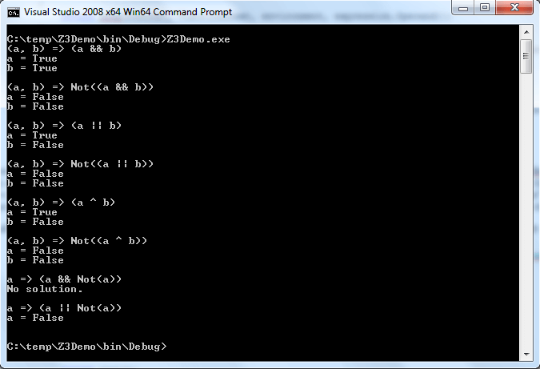

# LINQ to Z3 - Part 01 – Exploring the Z3 Theorem Prover 

Wednesday, April 15, 2009 1:33 AM

Author: Bart De Smet

## Introduction

Today I'm going to deviate from the typical path of mainstream technologies I normally cover and enter the domain of research instead. But very interesting and active research, with lots of practical implementations it turns out: **theorem provers**.

A little story first. I guess it should have been a couple of years ago now that I first came in touch with [Z3](https://github.com/Z3Prover/z3) rather accidentally when browsing the MSR website. At the time, I explored it just a little and was pretty excited about it but never go around to write about it. On my last speaker tour however, I met [Peli](https://www.microsoft.com/en-us/research/people/jhalleux/), a fellow Belgian here at Microsoft in Redmond, over at [Microsoft Research (MSR)](https://www.microsoft.com/en-us/research/) working on the [Pex](https://www.microsoft.com/en-us/research/project/pex-and-moles-isolation-and-white-box-unit-testing-for-net/) project (remember me to blog about Pex and [Code Contracts](https://www.microsoft.com/en-us/research/project/code-contracts/) in .NET 4.0). Since Pex uses Z3 internally you can guess the rest of the story and how I got inspired to dig Z3 up again and write this post.

## Enrich your vocab – Satisfiability Modulo Theories

So what's Z3 about? In two words: it's an **SMT solver**. SMT stands for Satisfiability Modulo Theories, but let's elaborate on those expensive words a bit to make things clear, going from right to left:

- **Theories** are domains within which we want to verify certain properties, ideally in an automated fashion. Z3 supports a number of built-in theories such as integer arithmetic, arrays and bit-vectors, free functions, etc. In practice those theories are mapped onto domain-specific models where theorem proving is required, e.g. what are the conditions to hit a certain code path (for test code generation as in Pex), can certain predicates be violated by a method's execution (for [Hoare triples](http://en.wikipedia.org/wiki/Hoare_logic) with pre- and post-conditions, or invariants as in Spec#), do certain properties have a possibility to be true simultaneously (indicating a bug, caught by verifying compilers like Boogie), or can a code block ever be hit (allowing dead code elimination by optimizing compilers);
- **Modulo** is simply glue which can be read as "under the presence of certain";
- **Satisfiability** is where the fun comes in. We have our theories as an ingredient for an SMT solver, but with a theory alone we can't do much. Well, we could feed in all possible inputs to build a table of potential outcomes. That's madness because of exponential growth for table sizes in terms of the number of inputs. Even more, often we're not interested in every single input: we rather want to know whether it's even possible for a certain formula to hold *ever* under the given theories. This is what satisfiability stands for, and it's a hard problem many mathematicians have dealt with (to get a broader context search for terms like "[Entscheidungsproblem](http://mathworld.wolfram.com/Entscheidungsproblem.html)", "decidability" or for names of famous mathematicians like Hilbert, Godel, Church and Turing, Kleene and Rosser, amongst others).

To illustrate this has been applied very practically, a few samples of success stories:

- Hyper-V, our flagship virtualization platform foundation, was built using a verifying C compiler ([VCC](http://research.microsoft.com/en-us/projects/vcc/)) making it possible to catch issues with heap corruption (provability of correctness is a great deal there, to avoid discussions where guest OS'es blame the host OS for memory corruption) and such;
- Driver verification in Windows 7 ([SDV 2.0](http://www.microsoft.com/whdc/devtools/tools/SDV.mspx)) leverages Z3;
- Spec# and Pex use Z3 for verification and test case generation purposes respectively – this extends to the domain of Code Contracts where static verification tools are integrated with Visual Studio to catch code contract violations early;
- Other domains include correctness checks for security stack implementations, cryptography algorithms, verification of garbage collectors (which are ultimately manipulators of large byte arrays) e.g. as used in [Singularity](http://research.microsoft.com/en-us/groups/os/singularity/) for core OS services, program termination analysis, etc.

In exciting domains as theorem solving, you can guess there are competitions too… [SMT-COMP'08](http://www.smtexec.org/exec/) is one such competition, where Z3 scored very high results.

## Getting started with Z3

The obvious first step towards exploring Z3 is to get your hands on the bits, which you can find [over here](https://github.com/Z3Prover/z3). I'll be using the 1.3 release of Z3 throughout this post. Please read the license that goes with Z3 as use of research technology has certain restrictions (I'm not a lawyer, so I'm not trying to paraphrase it in my own non-legalese :-)).

The installation will install binaries, samples and documentation to `%programfiles%\Microsoft Research\Z3-1.3.6`. Two files are of particular interest to our first exploration in this post:



- **z3.exe** is the command-line theorem prover. It can accept problem inputs in specialized formats used in the domain of SMTs.
- **Microsoft.Z3.dll** is a managed wrapper around the theorem solver, allowing any .NET language to call into Z3 as a library.

## Using the Z3.exe command-line tool

Before we get into doing any coding ourselves, let's just use the built-in command-line tool first. As this is an introductory post I'll just cover a very basic subset of the possibilities of the tool. More specifically, I'll restrict myself to the domain of Boolean logic – you know those things with true and false, conjunctions, disjunctions and negations – and just the subset of [propositional logic](http://en.wikipedia.org/wiki/Propositional_logic). This by itself is an interesting study, but be aware that the theories Z3 can tackle are much richer than just this.

Anyway, what we want to do is ask the theorem prover to try to find a set of assignments for variables that make a certain formula hold, in other words that satisfy the criterion expressed by the formula under the theory of Boolean logic. One way to express this is by using an input file in a format Z3 understands. We'll use the [SMT-LIB](http://www.smtlib.org/) format and write a file that states the problem of trying to satisfy the formula:

```
a xor b
```

In other words, try to find values for a and b for which this formula evaluates to true. We can translate this into SMT-LIB format by declaring a benchmark, the domain-specific lingo for a logical formula that will be checked for satisfiability against given background theories:

```
(benchmark demo
:status sat
:logic QF_UF
:extrapreds ((a) (b))
:formula (xor a b)
)
```

This simply means we're declaring a benchmark with name "demo" which we check for satisfiability ("sat") using the QF_UF theory (we could use other theories here, see [theories](http://combination.cs.uiowa.edu/smtlib/theories.html) for a full list, but don't worry too much about this for now) with predicates a and b and finally specifying our formula to be checked.

We save this specification to a .smt file and feed it in to z3 as shown below:



Here the /m command-line flag means to display a model, i.e. a set of inputs satisfying our formula, allowing us to check the result. Alternatively we could omit the /m flag in which case z3 will just print "sat" to signal it has been able to prove the formula. In the run above we chose to display the model and found a solution where a is chosen to be true and b chosen to be false.

Exercise for the reader: test a tautology (like a or not a) and a contradiction (like a and not a) and see what happens. Try changing the :status to unsat and see what happens.

## Say it with code

Z3 can also be used as a library either from native or managed code. For the purpose of this post, we'll explore the managed code route. In a simple C# console application project, add a reference to the Microsoft.Z3.dll file in the location we've shown earlier. Next, import the Microsoft.Z3 namespace. With this set up, we're ready to write code targeting Z3. Below is the simplest possible sample:

```cs
using System;
using Microsoft.Z3; 
namespace Z3Demo
{
    class Program
    {
        static void Main()
        {
            using (Config config = new Config())
            {
                config.SetParamValue("MODEL", "true"); // corresponds to /m switch 
                using (Context context = new Context(config))
                {
                    IntPtr a = context.MkConst("a", context.MkBoolType());
                    IntPtr b = context.MkConst("b", context.MkBoolType()); 
                    IntPtr xor = context.MkXor(a, b);
                    context.AssertCnstr(xor); 
                    Console.WriteLine(context.ToString(xor)); // (xor a b) 
                    Model model = null;
                    LBool result = context.CheckAndGetModel(ref model);
                    Console.WriteLine(result); 
                    if (model != null)
                    {
                        using (model)
                        {
                            bool aVal = model.GetBoolValueBool(model.Eval(a));
                            bool bVal = model.GetBoolValueBool(model.Eval(b));
                            Console.WriteLine("a = {0}, b = {1}", aVal, bVal);
                        }
                    }
                }
            }
        }
    }
}
```

Notice this API reflects the nature of the unmanaged (well, native) beast underneath it; the result of creating objects through the context is handle-based, hence the IntPtr use everywhere. The flow should be pretty clear: once we have the context, we build up our formula expression to be checked. Next, we assert the created constraint to the context: this allows multiple constraints to be solved together (something we're not doing yet in this sample). Finally we check the constraints and get a model back, assuming the result says "True" meaning satisfiability has been proven.

Executing this prints the following:



Just as we expected, didn't we?

Note for 64-bit users. Z3 relies on the VC runtime and has unmanaged code that requires to run as a 32-bit process. Just compiling your code as an IL-only assembly will cause the resulting executable to fail loading on a 64-bit machine as the CLR will JIT compile it into 64-bit at runtime. To fix this, either compile the assembly using the /platform:x86 flag (available in Visual Studio through the project properties) or run corflags.exe on the build output to force it as a 32-bit process:


Exercise to the reader: try out a few other propositions, possibly with more variables.

## LINQ, you say?

Did see the forest through the (expression) trees? What we just did was declaring an Boolean-typed expression tree:

```cs
var a = context.MkConst("a", context.MkBoolType());
var b = context.MkConst("b", context.MkBoolType()); 
var xor = context.MkXor(a, b);
```

Sounds familiar? True, LINQ expression trees have similar capabilities. Simply replace context by Expression, MkConst by Parameter, MkBoolType by typeof(bool) and MkXor by ExclusiveOr and you end up with a LINQ expression tree:

```cs
var a = Expression.Parameter(typeof(bool), "a");
var b = Expression.Parameter(typeof(bool), "b"); 
var xor = Expression.ExclusiveOr(a, b);
```

Of course, this only works because we're using a fairly trivial subset of operations Z3 supports (more about that another time), but for Boolean propositions we could go with LINQ expression trees. Wouldn't it be nice if we could write something like this:

```cs
static void Main()
{
    Solve((a, b) => a && b);
    Solve((a, b) => !(a && b));
    Solve((a, b) => a || b);
    Solve((a, b) => !(a || b));
    Solve((a, b) => a \^ b);
    Solve((a, b) => !(a \^ b));
    Solve(a => a && !a);
    Solve(a => a || !a);
}
```

and have it print the parameter values for which the lambda bodies evaluate to true? Guess what, let's give it a try now. First we'll add a couple of convenience overloads. As lambda expressions by themselves do not have a type (can either be delegates or expression trees representations thereof), it'd be quite tedious to have to write the full type name (Expression<Func<…>>) every time we want to solve for a particular lambda expression. So, a few overloads will help significantly:

```cs
private static void Solve(Expression<Func<bool, bool, bool>> ex)
{
    SolveCore(ex);
} 

private static void Solve(Expression<Func<bool, bool>> ex)
{
    SolveCore(ex);
}
```

This just calls into a SolveCore method that takes in the expression tree as a LambdaExpression object, so we can treat propositions with any number of "arguments" in exactly the same way. What we do inside this method is as follows:

```cs
private static void SolveCore(LambdaExpression f)
{
    Console.WriteLine(f);
    Dictionary<ParameterExpression, bool> solution;

    if (new LogicConstraintSolver(f).Solve(out solution))
    {
        foreach (var parameter in solution.Keys)
        {
            Console.WriteLine(parameter.Name + " = " + solution[parameter]);
        }
    }
    else
    {
        Console.WriteLine("No solution.");
    }
    Console.WriteLine();
}
```

The goal of this code is simple: given the lambda expression representing the proposition, go ahead and solve it, returning mappings from the parameters of the lambda expression (a, b, etc) onto the satisfying Boolean values.

What does the LogicConstraintSolver look like? Essentially a visitor over the expression tree that was fed in, making sure we don't don anything but elementary Boolean logic, and cross-compiling the expression tree into calls on a Z3 Context object.

```cs
class LogicConstraintSolver
{
    private LambdaExpression _ex; 
    public LogicConstraintSolver(LambdaExpression ex)
    {
        _ex = ex;
    }
```

Oh well, made nothing static for some reason. Just a proof of concept after all, and ideally you'd grab some stock visitor base type to derive from requiring instance members anyway. The next method is more interesting, I promise:

```cs
public bool Solve(out Dictionary<ParameterExpression, bool> solution)
{
    solution = null; 
    using (Config config = new Config())
    {
        config.SetParamValue("MODEL", "true"); 
        using (Context context = new Context(config))
        {
            var environment = GetEnvironment(context); 
            IntPtr constraint = Visit(context, environment, _ex.Body);
            context.AssertCnstr(constraint); 
            Model model = null;
            LBool result = context.CheckAndGetModel(ref model); 

            if (model != null)
            {
                using (model)
                {
                    solution = GetSolution(model, environment);
                }
            } 

            return result == LBool.True;
        }
    }
}
```

Macroscopically the same as our original hard-coded XOR implementation, but with the core replaced:

1.  First we get the environment, which will be a dictionary of ParameterExpression to IntPtr (sorry for the over-use of "var" in this sample). This maps the lambda parameters on the handles for the corresponding Z3 "constants" (returned from MkConst calls).
2.  A visitor method walks the expression tree recursively, turning it into a handle to the Z3 representation of the proposition being cross-compiled. To do so, we need the context (for use of its factory methods) and the environment from above.
3.  Finally we add the constraint, check the model, and get a solution which is again a dictionary but this time mapping the lambda parameters onto their corresponding truth values required to satisfy the proposition.

Now, let's investigate each of those helper methods. They're fairly trivial in fact:

```cs
private Dictionary<ParameterExpression, IntPtr> GetEnvironment(Context context)
{
    var environment = new Dictionary<ParameterExpression, IntPtr>(); 
    foreach (var parameter in _ex.Parameters)
    {
        if (parameter.Type != typeof(bool))
            throw new NotSupportedException("Non-Boolean parameter."); 
        environment.Add(parameter, context.MkConst(parameter.Name, context.MkBoolType()));
    } 
    return environment;
} 
```

No magic here; just enforcing every parameter to be Boolean-typed and calling into the context to construct constants with a Bool type, ultimately storing those in a mapping table. Next is our visitor.

```cs
private IntPtr Visit(Context context, Dictionary<ParameterExpression, IntPtr> environment, Expression expression)
{
    switch (expression.NodeType)
    {
        case ExpressionType.And:
        case ExpressionType.AndAlso:
            return VisitBinary(context, environment, (BinaryExpression)expression, (ctx, a, b) => ctx.MkAnd(a, b));
        case ExpressionType.Or:
        case ExpressionType.OrElse:
            return VisitBinary(context, environment, (BinaryExpression)expression, (ctx, a, b) => ctx.MkOr(a, b));
        case ExpressionType.ExclusiveOr:
            return VisitBinary(context, environment, (BinaryExpression)expression, (ctx, a, b) => ctx.MkXor(a, b));
        case ExpressionType.Not:
            return VisitUnary(context, environment, (UnaryExpression)expression, (ctx, a) => ctx.MkNot(a));
        case ExpressionType.Parameter:
            return VisitParameter(context, environment, (ParameterExpression)expression);
        default:\
            throw new NotSupportedException("Invalid logic expression.");
    }
} 
```

Here we're a bit functionally inspired. We just generalize the binary and unary cases, passing in a little lambda that given a context and the arguments can invoke the right factory method on the context object. Of course those arguments need to be filled in with concrete values, which is what the VisitBinary and VisitUnary methods are responsible for, based on recursion:

```cs
private IntPtr VisitBinary(Context context, Dictionary<ParameterExpression, IntPtr> environment, BinaryExpression expression, Func<Context, IntPtr, IntPtr, IntPtr> ctor)
{
    return ctor(context, Visit(context, environment, expression.Left), Visit(context, environment, expression.Right));
} 

private IntPtr VisitUnary(Context context, Dictionary<ParameterExpression, IntPtr> environment, UnaryExpression expression, Func<Context, IntPtr, IntPtr> ctor)
{
    return ctor(context, Visit(context, environment, expression.Operand));
} 

private IntPtr VisitParameter(Context context, Dictionary<ParameterExpression, IntPtr> environment, ParameterExpression parameter)
{
    IntPtr value;
    if (!environment.TryGetValue(parameter, out value))
        throw new NotSupportedException("Unknown parameter encountered: " + parameter.Name + "."); 
    return value;
}
```

All we're doing here is basic recursion and object construction through our passed in delegates: e.g. an AndAlso node in the LINQ expression tree has a Left and Right property. Recursively we translate those into IntPtr handles into the Z3 "object model". Given those values, the lambda "(ctx, a, b) => ctx.MkAnd(a, b)" invokes the MkAnd factory method to produce an And node in the target "object model". The case of visiting a parameter expression simply looks up the handle to the Z3 Const node (created in GetEnvironment before) and returns it.

Finally, we can get the solution from the generated model by getting the truth values for each parameter that occurs in the environment:

```cs
    private Dictionary<ParameterExpression, bool> GetSolution(Model model, Dictionary<ParameterExpression, IntPtr> environment)
    {
        var result = new Dictionary<ParameterExpression, bool>(); 
        foreach (var key in environment.Keys)
        {
            result[key] = model.GetBoolValueBool(model.Eval(environment[key]));
        } 
        return result;
    }
}
```

That's it. Barely 100 lines of code in total. And sure enough, It Just Works (TM):

 

Truly fascinating, isn't it? But this is just the tip of the iceberg. Some next time, we'll look at the domain of integer arithmetic to make things a bit more interesting...

Exercise to the reader, in the meantime: feed the output of the theorem prover back in to the original LINQ expression to check the correctness of the answer. Use either interpretation (by visiting the expression tree) or compilation (if you feel lame and prefer a simple .Compile() call somewhere).

Happy theorem proving!