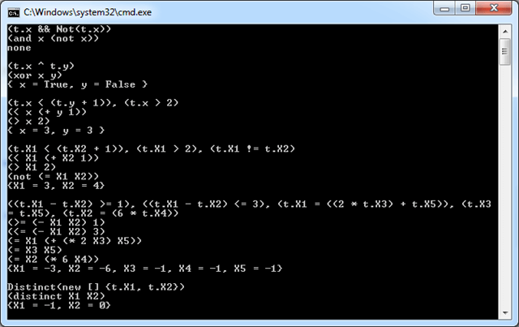
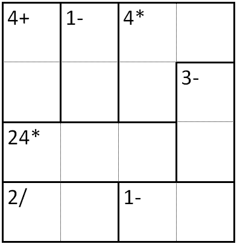

# LINQ to Z3 - Part 03 – Theorem Solving on Steroids

Sunday, September 27, 2009 11:55 PM

Author: Bart De Smet

## Introduction

It's [way too long ago](part-02-theorem-solving-on-steroids.md) I wrote about this side-project of mine, as I got side-tracked by other stuff both inside and outside the realm of LINQ (more about that some other time around). Last time, I showed how to put "the query pattern" to our hand by providing an implementation for the Where operator on top of some `Theorem<T>` type. Let's recap that to set the scene:

```cs
/// <summary>
/// Strongly-typed theorem type for use with LINQ syntax.
/// </summary>
/// <typeparam name="T">Enviroment type over which the theorem is defined.</typeparam>
public class Theorem<T> : Theorem
{
    …
    /// <summary>
    /// Where query operator, used to add constraints to the theorem.
    /// </summary>
    /// <param name="constraint">Theorem constraint expression.</param>
    /// <returns>Theorem with the new constraint applied.</returns>
    public Theorem<T> Where(Expression<Func<T, bool>> constraint)
    {
        return new Theorem<T>(base.Context, base.Constraints.Concat(new List<LambdaExpression> { constraint }));
    }
    /// <summary>
    /// Solves the theorem.
    /// </summary>
    /// <returns>Environment type instance with properties set to theorem-satisfying values.</returns>
    public T Solve()
    {
        return base.Solve<T>();
    }
}
```

We explained how the non-generic base type keeps track of a set of constraints that have been declared by the user through use of the where query operator, turned into expression trees by the Where signature's first parameter. This allows us to define constraints in a manner that's easy on the eye:

```cs
using (var ctx = new Z3Context())
{
    ctx.Log = Console.Out;
    var theo = from t in ctx.NewTheorem<Symbols<int, int, int, int, int>>()
               where t.X1 - t.X2 >= 1
               where t.X1 - t.X2 <= 3
               where t.X1 == (2 * t.X3) + t.X5
               where t.X3 == t.X5
               where t.X2 == 6 * t.X4
               select t;
    
    var result = theo.Solve();
    Console.WriteLine(result);
}
```

The Symbols generic type is one way to create a set of symbols used within the declared theorem's constraint (and to print the result if the constraints can be satisfied).

From the above you should be able to get an idea about the LambdaExpression instances that are kept in the Theorem<T>'s base type's instance field, as collected through the successive calls to Where. Remaining question is how to turn the defined theorem into action, something that's triggered through the call to Solve. This mystery is what we'll reveal today.

## Three steps to solve a theorem

LINQ to Z3 is in fact nothing more but a runtime translator of LINQ expression trees into Z3 calls. The Solve method lies at the heart of this translation and acts as the entry-point for the user. It's similar to the nature of GetEnumerator in a typical LINQ provider, causing a translation of the query's LINQ expression tree into the underlying query language (e.g. SQL, CAML, etc).

Three steps take place to make this work:

- First of all, we need to establish an *environment* with the theorem's symbols and inform Z3 about those. In other words, we map things like X1 to a Z3 counterpart, capturing the name and the type of the symbol (e.g. "T1", int). We keep track of the Z3 targets (in fact those will be IntPtr pointers, see further) so that subsequent phases of the translation can refer to those when asserting constraints.
- Secondly, constraints expressed through LINQ need to be translated into Z3 constraints, based on the established environment above. We call this phase the *assert constraints* phase which is implemented as an expression tree visitor pattern. Here the bulk of the implementation of LINQ to Z3 lives.
- Finally, Z3 is queried for a model that satisfied the asserted constraints. If such a model exists, it's still not ready for consumption by the end-user. To expose the solution in a user-friendly way, the symbols from the environment are mapped onto a .NET object that contains the values satisfying the expressed constraints. This phase is referred to as the *get solution* phase.

All of the above translates into the following implementation of Solve, on the Theorem base class:

```cs
/// <summary>
/// Solves the theorem using Z3.
/// </summary>
/// <typeparam name="T">Theorem environment type.</typeparam>
/// <returns>Result of solving the theorem; default(T) if the theorem cannot be satisfied.</returns>
protected T Solve<T>()
{
    // TODO: some debugging around issues with proper disposal of native resources…
    // using (Context context = _context.CreateContext())
    Context context = _context.CreateContext();
    {
        var environment = GetEnvironment<T>(context);
        AssertConstraints<T>(context, environment);
        Model model = null;
        if (context.CheckAndGetModel(ref model) != LBool.True)
            return default(T);
        return GetSolution<T>(model, environment);
    }
}
```

Recall from the previous post that `_context` is a `Z3Context` object that wraps the Z3 Config type. All we do there is creating a Z3 Context object which is the Z3 primitive to start defining a theorem on. Let's have a brief look at what Z3's Context type provides (simplified):

```cs
namespace Microsoft.Z3
{
    public class Context : IDisposable
    {
        public Context(Config config);
        public void AssertCnstr(IntPtr a);
        …
        public LBool Check();
        public LBool CheckAndGetModel(ref Model m);
        …
        public IntPtr MkAdd(IntPtr arg1, IntPtr arg2);
        public IntPtr MkAnd(IntPtr arg1, IntPtr arg2);
        public IntPtr MkApp(IntPtr d, IntPtr[] args);
        …
        public IntPtr MkBoolType();
        …
        public IntPtr MkConst(string s, IntPtr ty);
        …
        public IntPtr MkFuncDecl(string s, IntPtr[] domain, IntPtr range);
        …
        public IntPtr MkGe(IntPtr arg1, IntPtr arg2);
        public IntPtr MkGt(IntPtr arg1, IntPtr arg2);
        …
        public IntPtr MkXor(IntPtr t1, IntPtr t2);
        …
        public IntPtr Simplify(IntPtr a);
        …
    }
}
```

As you can see, the way to communicate with the Z3 library is through IntPtr objects. Recall the managed Z3 library is a simple wrapper on top of the native library and the "handle" mechanism to represent Z3 objects is surfaced through IntPtr objects (corresponding to pointers ultimately). Various Mk* functions exist to build up expressions that are used to represent constraints. For example, one could write:

```cs
IntPtr cA = ctx.MkConst("a", ctx.MkBoolType());
IntPtr cb = ctx.MkConst("b", ctx.MkBoolType());
IntPtr aAndb = ctx.MkAnd(cA, cB);
ctx.AssertCnstr(aAndb);
```

This asserts the constraint "a && b" (in C# lingo), where a and b are Boolean values, to the Z3 context. Ultimately we can call CheckAndGetModel to see whether the constraints can be satisfied, and if so a Model is passed back to us:

```cs
Model model = null;
if (context.CheckAndGetModel(ref model) != LBool.True)
   …
```

To consume the model, we can use the Model type in various ways:

```cs
namespace Microsoft.Z3
{
    public class Model : IDisposable
    {
        public void Display(TextWriter w);
        public void Display(TextWriter w, IntPtr v);
        …
        public IntPtr Eval(IntPtr __p1);
        …
        public bool GetBoolValueBool(IntPtr v);
        …
    }
}
```

Either we print the whole model or we evaluate expressions against the Model (amongst other options). Below is a sample of how a and b can be retrieved. Notice how cA and cB are used again to query the model:

```cs
bool a = model.GetBoolValueBool(model.Eval(cA));
bool b = model.GetBoolValueBool(model.Eval(cB));
```

All of the above is obviously a code fragment specialized to solve the constraint "a && b", getting the result back as two Booleans. In LINQ to Z3 we need to generalize the steps above:

- We'll introduce an environment that maps every symbol from the theorem onto the underlying IntPtr retrieved from calling MkConst.
- We'll visit the expression trees that declare the constraints, generating Z3 expressions (e.g. via MkAnd) and asserting them on the Context.
- We'll extract the model's values for the bindings in the environment to instantiate an object representing the solution (if any).

Let's start by looking at the code to establish an environment.

## Taking care of the environment

First we need to establish the environment from the T generic parameter type. E.g. in the aforementioned sample `Symbols<…>` is our starting point:

```cs
from t in ctx.NewTheorem<Symbols<int, int, int, int, int>>() … 
```

But the user could equally well use different means to establish a bag of symbols to write a theorem against, e.g.:

```cs
from t in ctx.NewTheorem(new { x = default(bool), y = default(bool) }) …
```

We need to let Z3 know what the types are of the symbols we're using here. Obviously we're going to use reflection to extract this information as shown below:

```cs
/// <summary>
/// Maps the properties on the theorem environment type to Z3 handles for bound variables.
/// </summary>
/// <typeparam name="T">Theorem environment type to create a mapping table for.</typeparam>
/// <param name="context">Z3 context.</param>
/// <returns>Environment mapping table from .NET properties onto Z3 handles.</returns>
private static Dictionary<PropertyInfo, IntPtr> GetEnvironment<T>(Context context)
{
    var environment = new Dictionary<PropertyInfo, IntPtr>();
    //
    // All public properties are considered part of the theorem's environment.
    // Notice we can't require custom attribute tagging if we want the user to be able to
    // use anonymous types as a convenience solution.
    //
    foreach (var parameter in typeof(T).GetProperties(BindingFlags.Public | BindingFlags.Instance))
    {
        //
        // Normalize types when facing Z3. Theorem variable type mappings allow for strong
        // typing within the theorem, while underlying variable representations are Z3-
        // friendly types.
        //
        var parameterType = parameter.PropertyType;
        var parameterTypeMapping = (TheoremVariableTypeMappingAttribute)parameterType.GetCustomAttributes(typeof(TheoremVariableTypeMappingAttribute), false).SingleOrDefault();

        if (parameterTypeMapping != null)
            parameterType = parameterTypeMapping.RegularType;
        //
        // Map the environment onto Z3-compatible types.
        //
        if (parameterType == typeof(bool))
            environment.Add(parameter, context.MkConst(parameter.Name, context.MkBoolType()));
        else if (parameterType == typeof(int))
            environment.Add(parameter, context.MkConst(parameter.Name, context.MkIntType()));
        else
            throw new NotSupportedException("Unsupported parameter type for " + parameter.Name + ".");
    }

    return environment;
}
```


To understand the above, start from the method's contract: given a Z3 context, we're going to return a dictionary that maps PropertyInfo objects onto IntPtr objects representing the symbols introduced on the Z3 context. The code is fairly straightforward to understand and only cares about properties (though one could extend it to allow fields as well). Ignore the TheoremVariableTypeMapping part, which can be dropped from the code for the time being, which will be explained in subsequent posts. Notice we only support Z3's Bool and Int types.

This was easy, wasn't it? Next, the meat of the translator: translating and asserting constraints.

## Asserting constraints

Asserting the constraints from the LINQ expression trees onto Z3 constraints is the next, and most complicated, step. The entry-point to the method responsible for this looks as follows:

```cs
/// <summary>
/// Asserts the theorem constraints on the Z3 context.
/// </summary>
/// <param name="context">Z3 context.</param>
/// <param name="environment">Environment with bindings of theorem variables to Z3 handles.</param>
/// <typeparam name="T">Theorem environment type.</typeparam>
private void AssertConstraints<T>(Context context, Dictionary<PropertyInfo, IntPtr> environment)
{
    var constraints = _constraints;
    
    //
    // Global rewwriter registered?
    //
    var rewriterAttr = (TheoremGlobalRewriterAttribute)typeof(T).GetCustomAttributes(typeof(TheoremGlobalRewriterAttribute), false).SingleOrDefault();
    if (rewriterAttr != null)
    {
        //
        // Make sure the specified rewriter type implements the ITheoremGlobalRewriter.
        //
        var rewriterType = rewriterAttr.RewriterType;
        if (!typeof(ITheoremGlobalRewriter).IsAssignableFrom(rewriterType))
            throw new InvalidOperationException("Invalid global rewriter type definition. Did you implement ITheoremGlobalRewriter?");

        //
        // Assume a parameterless public constructor to new up the rewriter.
        //
        var rewriter = (ITheoremGlobalRewriter)Activator.CreateInstance(rewriterType);

        //
        // Do the rewrite.
        //
        constraints = rewriter.Rewrite(constraints);
    }

    //
    // Visit, assert and log.
    //
    foreach (var constraint in constraints)
    {
        IntPtr c = Visit(context, environment, constraint.Body, constraint.Parameters[0]);
        context.AssertCnstr(c);
        _context.LogWriteLine(context.ToString(c));
    }
}
```

I'm not holding any information back, so some of the above can be ignored for the time being: mask away all of the code with the word rewriter in it, as it will be explained next time around. (To satisfy your curiosity, rewriters allow to create domain-specific constraint languages, e.g. to solve a Kakuro puzzle.)

The essence of the code lives in the foreach-loop that translates the lambda expression-based constraints by a call to the Visit method, returning a Z3 expression for the constraint which is subsequently asserted on the Z3 context. Obviously Visit is where all the magic happens. To do so, it gets four parameters:

- The Z3 context, to call Mk* functions on during the translation.
- Our environment, to be able to map occurrences of symbols (expressed as properties) onto the introduced Z3 corresponding objects.
- Obviously the lambda expression's body to translate (cf. `Expression<Func<T, bool>>` constraint).
- And finally, the lambda expression's parameter expression object (so that calls on it can be recognized, e.g. `symbols => … symbols.X1 …)`.

On to the visitor now. Before we do so, let's think a bit about the operations we want to support on constraints: arithmetic (`+, -, *, /, %`), logic (`&&, ||, !`) and relational (`<, <=, >, >=, ==, !=`). There'll be a few more as we shall see in a minute. As usual with expression trees, lots of switch-statements will be attending the party:

```cs
/// <summary>
/// Main visitor method to translate the LINQ expression tree into a Z3 expression handle.
/// </summary>
/// <param name="context">Z3 context.</param>
/// <param name="environment">Environment with bindings of theorem variables to Z3 handles.</param>
/// <param name="expression">LINQ expression tree node to be translated.</param>
/// <param name="param">Parameter used to express the constraint on.</param>
/// <returns>Z3 expression handle.</returns>
private IntPtr Visit(Context context, Dictionary<PropertyInfo, IntPtr> environment, Expression expression, ParameterExpression param)
{
    //
    // Largely table-driven mechanism, providing constructor lambdas to generic Visit*
    // methods, classified by type and arity.
    //
    switch (expression.NodeType)
    {
        case ExpressionType.And:
        case ExpressionType.AndAlso:
            return VisitBinary(context, environment, (BinaryExpression)expression, param, (ctx, a, b) => ctx.MkAnd(a, b));
        case ExpressionType.Or:
        case ExpressionType.OrElse:
            return VisitBinary(context, environment, (BinaryExpression)expression, param, (ctx, a, b) => ctx.MkOr(a, b));
        case ExpressionType.ExclusiveOr:
            return VisitBinary(context, environment, (BinaryExpression)expression, param, (ctx, a, b) => ctx.MkXor(a, b));
        case ExpressionType.Not:
            return VisitUnary(context, environment, (UnaryExpression)expression, param, (ctx, a) => ctx.MkNot(a));
        case ExpressionType.Negate:
        case ExpressionType.NegateChecked:
            return VisitUnary(context, environment, (UnaryExpression)expression, param, (ctx, a) => ctx.MkUnaryMinus(a));
        case ExpressionType.Add:
        case ExpressionType.AddChecked:
            return VisitBinary(context, environment, (BinaryExpression)expression, param, (ctx, a, b) => ctx.MkAdd(a, b));
        case ExpressionType.Subtract:
        case ExpressionType.SubtractChecked:
            return VisitBinary(context, environment, (BinaryExpression)expression, param, (ctx, a, b) => ctx.MkSub(a, b));
        case ExpressionType.Multiply:
        case ExpressionType.MultiplyChecked:
            return VisitBinary(context, environment, (BinaryExpression)expression, param, (ctx, a, b) => ctx.MkMul(a, b));
        case ExpressionType.Divide:
            return VisitBinary(context, environment, (BinaryExpression)expression, param, (ctx, a, b) => ctx.MkDiv(a, b));
        case ExpressionType.Modulo:
            return VisitBinary(context, environment, (BinaryExpression)expression, param, (ctx, a, b) => ctx.MkRem(a, b));
        case ExpressionType.LessThan:
            return VisitBinary(context, environment, (BinaryExpression)expression, param, (ctx, a, b) => ctx.MkLt(a, b));
        case ExpressionType.LessThanOrEqual:
            return VisitBinary(context, environment, (BinaryExpression)expression, param, (ctx, a, b) => ctx.MkLe(a, b));
        case ExpressionType.GreaterThan:
            return VisitBinary(context, environment, (BinaryExpression)expression, param, (ctx, a, b) => ctx.MkGt(a, b));
        case ExpressionType.GreaterThanOrEqual:
            return VisitBinary(context, environment, (BinaryExpression)expression, param, (ctx, a, b) => ctx.MkGe(a, b));
        case ExpressionType.Equal:
            return VisitBinary(context, environment, (BinaryExpression)expression, param, (ctx, a, b) => ctx.MkEq(a, b));
        case ExpressionType.NotEqual:
            return VisitBinary(context, environment, (BinaryExpression)expression, param, (ctx, a, b) => ctx.MkNot(ctx.MkEq(a, b)));
        case ExpressionType.MemberAccess:
            return VisitMember(environment, (MemberExpression)expression, param);
        case ExpressionType.Constant:
            return VisitConstant(context, (ConstantExpression)expression);
        case ExpressionType.Call:
            return VisitCall(context, environment, (MethodCallExpression)expression, param);
        default:
            throw new NotSupportedException("Unsupported expression node type encountered: " + expression.NodeType);
    }
}
```

Notice the above is made as declarative as possible: most expression tree node types are mapped on either unary or binary specialized visitor methods, passing in a lambda expression that acts as the "Z3 constructor". For example, And (for & in C#) uses a `(ctx, a, b) => ctx.MkAnd(a, b)` argument. The `VisitBinary` method will be responsible to recursively translate the left-hand side and right-hand side of the And operation (e.g. x & y, where x and y can be arbitrarily complex BLOCKED EXPRESSION, ultimately feeding the resulting Z3-returned `IntPtr` objects into the supplied lambda expression.

Next to the VisitBinary and VisitUnary calls, there are specialized calls for the MemberAccess, Constant and Call expression tree nodes. We'll defer the discussion of those for a moment and focus on binary and unary calls first:

```cs
/// <summary>
/// Visitor method to translate a binary expression.
/// </summary>
/// <param name="context">Z3 context.</param>
/// <param name="environment">Environment with bindings of theorem variables to Z3 handles.</param>
/// <param name="expression">Binary expression.</param>
/// <param name="ctor">Constructor to combine recursive visitor results.</param>
/// <param name="param">Parameter used to express the constraint on.</param>
/// <returns>Z3 expression handle.</returns>
private IntPtr VisitBinary(Context context, Dictionary<PropertyInfo, IntPtr> environment, BinaryExpression expression, ParameterExpression param, Func<Context, IntPtr, IntPtr, IntPtr> ctor)
{
    return ctor(context, Visit(context, environment, expression.Left, param), Visit(context, environment, expression.Right, param));
}

/// <summary>
/// Visitor method to translate a unary expression.
/// </summary>
/// <param name="context">Z3 context.</param>
/// <param name="environment">Environment with bindings of theorem variables to Z3 handles.</param>
/// <param name="expression">Unary expression.</param>
/// <param name="ctor">Constructor to combine recursive visitor results.</param>
/// <param name="param">Parameter used to express the constraint on.</param>
/// <returns>Z3 expression handle.</returns>
private IntPtr VisitUnary(Context context, Dictionary<PropertyInfo, IntPtr> environment, UnaryExpression expression, ParameterExpression param, Func<Context, IntPtr, IntPtr> ctor)
{
    return ctor(context, Visit(context, environment, expression.Operand, param));
}
```

More documentation than anything else :-). Those methods simply visit the expression's operands (e.g. Left, Right for a binary expression, Operand for a unary one) recursively. The obtained results, of type IntPtr, are fed into the "ctor" delegate parameter to obtain the final result. Trivial stuff.

Now the more complicated visitor methods for members, constants and method calls. First, constants:

```cs
/// <summary>
/// Visitor method to translate a constant expression.
/// </summary>
/// <param name="context">Z3 context.</param>
/// <param name="constant">Constant expression.</param>
/// <returns>Z3 expression handle.</returns>
private static IntPtr VisitConstant(Context context, ConstantExpression constant)
{
    if (constant.Type == typeof(int))
        return context.MkNumeral((int)constant.Value, context.MkIntType());
    else if (constant.Type == typeof(bool))
        return (bool)constant.Value ? context.MkTrue() : context.MkFalse();
    throw new NotSupportedException("Unsupported constant type.");
}
```

This code should be easy enough to understand as well: looking at the type of the constant value, different Z3 calls are made based on the Value property's value.

Members get a tiny bit more involved, as that's where we need to recognize property accesses for symbols. In other words, we need to recognize the

```cs
/// <summary>
/// Visitor method to translate a member expression.
/// </summary>
/// <param name="environment">Environment with bindings of theorem variables to Z3 handles.</param>
/// <param name="member">Member expression.</param>
/// <param name="param">Parameter used to express the constraint on.</param>
/// <returns>Z3 expression handle.</returns>
private static IntPtr VisitMember(Dictionary<PropertyInfo, IntPtr> environment, MemberExpression member, ParameterExpression param)
{
    //
    // E.g. Symbols l = ...;
    //      theorem.Where(s => l.X1)
    //                         ^^
    //
    if (member.Expression != param)
        throw new NotSupportedException("Encountered member access not targeting the constraint parameter.");
    //
    // Only members we allow currently are direct accesses to the theorem's variables
    // in the environment type. So we just try to find the mapping from the environment
    // bindings table.
    //
    PropertyInfo property;
    IntPtr value;
    
    if ((property = member.Member as PropertyInfo) == null
        || !environment.TryGetValue(property, out value))
        throw new NotSupportedException("Unknown parameter encountered: " + member.Member.Name + ".");

    return value;
}
```

First we make sure the user didn't access something outside the realm of the constraint parameter, e.g.:

```cs
Symbols<int, int, int, int, int> oops = new Symbols<int, int, int, int, int>();
var theo = from t in ctx.NewTheorem<Symbols<int, int, int, int, int>>()
           where t.X1 - oops.X2 >= 1
           where t.X1 - t.X2 <= 3
           where t.X1 == (2 * t.X3) + t.X5
           where t.X3 == t.X5
           where t.X2 == 6 * t.X4
           select t;
```

In essence this is some kind of scope check with regards to the expressed theorem. Recall the above corresponds to calls to the Where method that look as follows:

```cs
ctx.NewTheorem<Symbols]<int, int, int, int, int>>() .Where(t => t.X1 - oops.X2 >= 1)…
```

We've captured the lambda expression parameter "t" in the AssertConstraints method and carry it on throughout the visitor so we can check it's used as the left-hand side inside constraint expressions.

Note: This restriction limits expressiveness quite a bit. For example, capturing an outer variable gives rise to a *closure* to be created, which is accessed through field accesses (of type MemberExpression). Such potentially valid uses get rejected by the code above. To restore such functionality, one can employ partial compilation using LambdaExpression.Compile, after checking the expression doesn't contain the lambda parameter. The essence is shown below:\

```cs
if (member.Expression != param)
{
    if (!IsLambdaParameterFree(member.Expression, param))
        throw new NotSupportedException("Unsupported member expression using constraint parameter.");

   // Evaluation outside Z3.
    object value = Expression.Lambda(member.Expression).Compile().DynamicInvoke();
    return VisitConstant(context, Expression.Constant(value));
}
```

We leave the implementation of such techniques to the reader, together with the task to hook this logic up in al the appropriate places (default case of Visit, in VisitCall further on, etc).

VisitMember finally consults the environment to map the property access back to the Z3 object generated in the GetEnvironment call.

Finally, we have a VisitCall method as well. Once more, I've kept some advanced rewriter stuff in here (to be explained in a subsequent post), so ignore that for the time being. The reason we implement VisitCall is to provide a means to expose advanced Z3 constructs efficiently, e.g. the Distinct operator. To do so, a Z3Methods class is provided:

```cs
/// <summary>
/// Z3 predicate methods.
/// </summary>
public static class Z3Methods
{
    /// <summary>
    /// Creates a predicate constraining the given symbols as distinct values.
    /// </summary>
    /// <typeparam name="T">Type of the parameters.</typeparam>
    /// <param name="symbols">Symbols that are required to be distinct.</param>
    /// <returns>Predicate return value.</returns>
    /// <remarks>This method should only be used within LINQ expressions.</remarks>
    public static bool Distinct<T>(params T[] symbols /* type? */)
    {
        throw new NotSupportedException("This method should only be used in query expressions.");
    }
}
```

This is very similar to the SqlMethods class of LINQ to SQL, and available for future extensions. VisitCall has the simple task to recognize calls to Z3Methods methods, turning them into the corresponding Z3 primitives.

```cs
/// <summary>
/// Visitor method to translate a method call expression.
/// </summary>
/// <param name="context">Z3 context.</param>
/// <param name="environment">Environment with bindings of theorem variables to Z3 handles.</param>
/// <param name="call">Method call expression.</param>
/// <param name="param">Parameter used to express the constraint on.</param>
/// <returns>Z3 expression handle.</returns>
private IntPtr VisitCall(Context context, Dictionary<PropertyInfo, IntPtr> environment, MethodCallExpression call, ParameterExpression param)
{
    var method = call.Method;
    //
    // Does the method have a rewriter attribute applied?
    //
    var rewriterAttr = (TheoremPredicateRewriterAttribute)method.GetCustomAttributes(typeof(TheoremPredicateRewriterAttribute), false).SingleOrDefault();
    if (rewriterAttr != null)
    {
        //
        // Make sure the specified rewriter type implements the ITheoremPredicateRewriter.
        //
        var rewriterType = rewriterAttr.RewriterType;
        if (!typeof(ITheoremPredicateRewriter).IsAssignableFrom(rewriterType))
            throw new InvalidOperationException("Invalid predicate rewriter type definition. Did you implement ITheoremPredicateRewriter?");
        //
        // Assume a parameterless public constructor to new up the rewriter.
        //
        var rewriter = (ITheoremPredicateRewriter)Activator.CreateInstance(rewriterType);
        //
        // Make sure we don't get stuck when the rewriter just returned its input. Valid
        // rewriters should satisfy progress guarantees.
        //
        var result = rewriter.Rewrite(call);
        if (result == call)
            throw new InvalidOperationException("The expression tree rewriter of type " + rewriterType.Name + " did not perform any rewrite. Aborting compilation to avoid infinite looping.");
        //
        // Visit the rewritten expression.
        //
        return Visit(context, environment, result, param);
    }
    //
    // Filter for known Z3 operators.
    //
    if (method.IsGenericMethod && method.GetGenericMethodDefinition() == typeof(Z3Methods).GetMethod("Distinct"))
    {
        //
        // We know the signature of the Distinct method call. Its argument is a params
        // array, hence we expect a NewArrayExpression.
        //
        var arr = (NewArrayExpression)call.Arguments[0];
        var args = from arg in arr.Expressions select Visit(context, environment, arg, param);
        return context.MkDistinct(args.ToArray());
    }
    else
        throw new NotSupportedException("Unknown method call:" + method.ToString());
}
```

In particular, a call to Distinct is processed by inspecting its argument corresponding to the params-array, recursively translating any of its elements (e.g. Z3Methods.Distinct(1, 2, s.X1, s.X2) will give rise to two constant expressions and two member accesses, but more complex expressions can occur as the arguments as well…). Ultimately, MkDistinct is called and all is happy.

Now that we're done investigating the visitor, we can have a look at the final stage of the LINQ to Z3-driven theorem solving, the *get solution* phase.

## Getting the solution

To expose the solution to the user, we new up a Plain Old CLR Object (POCO) of the theorem's generic parameter type T. All there's left to do here is to use some reflection voodoo to instantiate T, populate its properties somehow, and return the object. Different situations can occur, based on the way the type is defined. In particular, use of an anonymous type gives some problems as there's no formal correlation between the generated constructor and the type's properties (which are get-only, so we can't assign values directly). This isn't super-exciting stuff, but nonetheless:

```cs
/// <summary>
/// Gets the solution object for the solved theorem.
/// </summary>
/// <typeparam name="T">Environment type to create an instance of.</typeparam>
/// <param name="model">Z3 model to evaluate theorem parameters under.</param>
/// <param name="environment">Environment with bindings of theorem variables to Z3 handles.</param>
/// <returns>Instance of the enviroment type with theorem-satisfying values.</returns>
private static T GetSolution<T>(Model model, Dictionary<PropertyInfo, IntPtr> environment)
{
    Type t = typeof(T);
    //
    // Determine whether T is a compiler-generated type, indicating an anonymous type.
    // This check might not be reliable enough but works for now.
    //
    if (t.GetCustomAttributes(typeof(CompilerGeneratedAttribute), false).Any())
    {
        //
        // Anonymous types have a constructor that takes in values for all its properties.
        // However, we don't know the order and it's hard to correlate back the parameters
        // to the underlying properties. So, we want to bypass that constructor altogether
        // by using the FormatterServices to create an uninitialized (all-zero) instance.
        //
        T result = (T)FormatterServices.GetUninitializedObject(t);
        //
        // Here we take advantage of undesirable knowledge on how anonymous types are
        // implemented by the C# compiler. This is risky but we can live with it for
        // now in this POC. Because the properties are get-only, we need to perform
        // nominal matching with the corresponding backing fields.
        //
        var fields = t.GetFields(BindingFlags.NonPublic | BindingFlags.Instance);
        foreach (var parameter in environment.Keys)
        {
            //
            // Mapping from property to field.
            //
            var field = fields.Where(f => f.Name.StartsWith("<" + parameter.Name + ">")).SingleOrDefault();
            //
            // Evaluation of the values though the handle in the environment bindings.
            //
            IntPtr val = model.Eval(environment[parameter]);
            if (parameter.PropertyType == typeof(bool))
                field.SetValue(result, model.GetBoolValueBool(val));
            else if (parameter.PropertyType == typeof(int))
                field.SetValue(result, model.GetNumeralValueInt(val));
            else
                throw new NotSupportedException("Unsupported parameter type for " + parameter.Name + ".");
        }
        return result;
    }
    else
    {
        //
        // Straightforward case of having an "onymous type" at hand.
        //
        T result = Activator.CreateInstance<T>();
        foreach (var parameter in environment.Keys)
        {
            //
            // Normalize types when facing Z3. Theorem variable type mappings allow for strong
            // typing within the theorem, while underlying variable representations are Z3-
            // friendly types.
            //
            var parameterType = parameter.PropertyType;
            var parameterTypeMapping = (TheoremVariableTypeMappingAttribute)parameterType.GetCustomAttributes(typeof(TheoremVariableTypeMappingAttribute), false).SingleOrDefault();
            if (parameterTypeMapping != null)
                parameterType = parameterTypeMapping.RegularType;
            //
            // Evaluation of the values though the handle in the environment bindings.
            //
            IntPtr val = model.Eval(environment[parameter]);
            object value;
            if (parameterType == typeof(bool))
                value = model.GetBoolValueBool(val);
            else if (parameterType == typeof(int))
                value = model.GetNumeralValueInt(val);
            else
                throw new NotSupportedException("Unsupported parameter type for " + parameter.Name + ".");
            //
            // If there was a type mapping, we need to convert back to the original type.
            // In that case we expect a constructor with the mapped type to be available.
            //
            if (parameterTypeMapping != null)
            {
                var ctor = parameter.PropertyType.GetConstructor(new Type[] { parameterType });
                if (ctor == null)
                    throw new InvalidOperationException("Could not construct an instance of the mapped type " + parameter.PropertyType.Name + ". No public constructor with parameter type " + parameterType + " found.");
                value = ctor.Invoke(new object[] { value });
            }
            parameter.SetValue(result, value, null);
        }
        return result;
    }
}
```

Focus on the non-anonymous type case at the bottom, ignoring parts on type mappings (part of the stuff to be explained another time). The essence is plain simple:

- Create an instance of the type.
- Go over the environment and:
  - Extract the value from the Z3 model using the environment's stored Z3 object.
  - Assign it to the property.

Notice get-only properties are not supported, though one could look at LINQ to SQL as a source of inspiration to deal with such cases as well, if desired.

## Samples

A few samples of simple theorems using the infrastructure provided above are shown below:

```cs
using (var ctx = new Z3Context())
{
    ctx.Log = Console.Out;
    Print(from t in ctx.NewTheorem(new { x = default(bool) })
          where t.x && !t.x
          select t);
    Print(from t in ctx.NewTheorem(new { x = default(bool), y = default(bool) })
          where t.x ^ t.y
          select t);
    Print(from t in ctx.NewTheorem(new { x = default(int), y = default(int) })
          where t.x < t.y + 1
          where t.x > 2
          select t);
    Print(from t in ctx.NewTheorem<Symbols<int, int>>()
          where t.X1 < t.X2 + 1
          where t.X1 > 2
          where t.X1 != t.X2
          select t);
    Print(from t in ctx.NewTheorem<Symbols<int, int, int, int, int>>()
          where t.X1 - t.X2 >= 1
          where t.X1 - t.X2 <= 3
          where t.X1 == (2 * t.X3) + t.X5
          where t.X3 == t.X5
          where t.X2 == 6 * t.X4
          select t);
    Print(from t in ctx.NewTheorem<Symbols<int, int>>()
          where Z3Methods.Distinct(t.X1, t.X2)
          select t);
}
```

The reader should be able to trace through those samples mentally without much trouble. The Print method is shown below:

```cs
private static void Print<T>(Theorem<T> t) where T : class
{
    Console.WriteLine(t);
    var res = t.Solve();
    Console.WriteLine(res == null ? "none" : res.ToString());
    Console.WriteLine();
}
```

Given all of this, the output looks as follows:



Sweet! Notice the use of the Log property on the context object causes the constraints to be emitted to the screen, in LISP-style prefix notation for operators and operands.

## Sneak peak

Given the baseline infrastructure we covered in this post, we can start adding layers of abstraction over it to make more advanced theorems easier to express. An example is a Sudoku puzzle:

```cs
var s1 = from t in Sudoku.Create(ctx)
         where t.Cell13 == 2 && t.Cell16 == 1 && t.Cell18 == 6
         where t.Cell23 == 7 && t.Cell26 == 4 
         where t.Cell31 == 5 && t.Cell37 == 9
         where t.Cell42 == 1 && t.Cell44 == 3
         where t.Cell51 == 8 && t.Cell55 == 5 && t.Cell59 == 4
         where t.Cell66 == 6 && t.Cell68 == 2
         where t.Cell73 == 6 && t.Cell79 == 7
         where t.Cell84 == 8 && t.Cell87 == 3
         where t.Cell92 == 4 && t.Cell94 == 9 && t.Cell97 == 2
         select t;
Console.WriteLine(s1);
Console.WriteLine(s1.Solve());
Console.WriteLine();
```

Or more compactly represented as a string:

```cs
var s2 = Sudoku.Parse(ctx, @"..2..1.6.
                             ..7..4...
                             5.....9..
                             .1.3.....
                             8...5...4
                             .....6.2.
                             ..6.....7
                             ...8..3..
                             .4.9..2..");
Console.WriteLine(s2);
Console.WriteLine(s2.Solve());
Console.WriteLine();
```

Here we've created a domain-specific theorem type, Sudoku, that's responsible to provide parts of the constraints. In fact, a Sudoku has much more constraints than the ones specified by the user: rows, columns and blocks need to contain unique values from 1-9, and every cell has to be within that range. For the innocent-looking Sudoku above, we get the following set of constraints:

```
((1 <= p.Cell11) && (p.Cell11 <= 9)),
((1 <= p.Cell12) && (p.Cell12 <= 9)),
((1 <= p.Cell13) && (p.Cell13 <= 9)),
((1 <= p.Cell14) && (p.Cell14 <= 9)),
((1 <= p.Cell15) && (p.Cell15 <= 9)),
((1 <= p.Cell16) && (p.Cell16 <= 9)),
((1 <= p.Cell17) && (p.Cell17 <= 9)),
((1 <= p.Cell18) && (p.Cell18 <= 9)),
((1 <= p.Cell19) && (p.Cell19 <= 9)),
((1 <= p.Cell21) && (p.Cell21 <= 9)),
((1 <= p.Cell22) && (p.Cell22 <= 9)),
((1 <= p.Cell23) && (p.Cell23 <= 9)),
((1 <= p.Cell24) && (p.Cell24 <= 9)),
((1 <= p.Cell25) && (p.Cell25 <= 9)),
((1 <= p.Cell26) && (p.Cell26 <= 9)),
((1 <= p.Cell27) && (p.Cell27 <= 9)),
((1 <= p.Cell28) && (p.Cell28 <= 9)),
((1 <= p.Cell29) && (p.Cell29 <= 9)),
((1 <= p.Cell31) && (p.Cell31 <= 9)),
((1 <= p.Cell32) && (p.Cell32 <= 9)),
((1 <= p.Cell33) && (p.Cell33 <= 9)),
((1 <= p.Cell34) && (p.Cell34 <= 9)),
((1 <= p.Cell35) && (p.Cell35 <= 9)),
((1 <= p.Cell36) && (p.Cell36 <= 9)),
((1 <= p.Cell37) && (p.Cell37 <= 9)),
((1 <= p.Cell38) && (p.Cell38 <= 9)),
((1 <= p.Cell39) && (p.Cell39 <= 9)),
((1 <= p.Cell41) && (p.Cell41 <= 9)),
((1 <= p.Cell42) && (p.Cell42 <= 9)),
((1 <= p.Cell43) && (p.Cell43 <= 9)),
((1 <= p.Cell44) && (p.Cell44 <= 9)),
((1 <= p.Cell45) && (p.Cell45 <= 9)),
((1 <= p.Cell46) && (p.Cell46 <= 9)),
((1 <= p.Cell47) && (p.Cell47 <= 9)),
((1 <= p.Cell48) && (p.Cell48 <= 9)),
((1 <= p.Cell49) && (p.Cell49 <= 9)),
((1 <= p.Cell51) && (p.Cell51 <= 9)),
((1 <= p.Cell52) && (p.Cell52 <= 9)),
((1 <= p.Cell53) && (p.Cell53 <= 9)),
((1 <= p.Cell54) && (p.Cell54 <= 9)),
((1 <= p.Cell55) && (p.Cell55 <= 9)),
((1 <= p.Cell56) && (p.Cell56 <= 9)),
((1 <= p.Cell57) && (p.Cell57 <= 9)),
((1 <= p.Cell58) && (p.Cell58 <= 9)),
((1 <= p.Cell59) && (p.Cell59 <= 9)),
((1 <= p.Cell61) && (p.Cell61 <= 9)),
((1 <= p.Cell62) && (p.Cell62 <= 9)),
((1 <= p.Cell63) && (p.Cell63 <= 9)),
((1 <= p.Cell64) && (p.Cell64 <= 9)),
((1 <= p.Cell65) && (p.Cell65 <= 9)),
((1 <= p.Cell66) && (p.Cell66 <= 9)),
((1 <= p.Cell67) && (p.Cell67 <= 9)),
((1 <= p.Cell68) && (p.Cell68 <= 9)),
((1 <= p.Cell69) && (p.Cell69 <= 9)),
((1 <= p.Cell71) && (p.Cell71 <= 9)),
((1 <= p.Cell72) && (p.Cell72 <= 9)),
((1 <= p.Cell73) && (p.Cell73 <= 9)),
((1 <= p.Cell74) && (p.Cell74 <= 9)),
((1 <= p.Cell75) && (p.Cell75 <= 9)),
((1 <= p.Cell76) && (p.Cell76 <= 9)),
((1 <= p.Cell77) && (p.Cell77 <= 9)),
((1 <= p.Cell78) && (p.Cell78 <= 9)),
((1 <= p.Cell79) && (p.Cell79 <= 9)),
((1 <= p.Cell81) && (p.Cell81 <= 9)),
((1 <= p.Cell82) && (p.Cell82 <= 9)),
((1 <= p.Cell83) && (p.Cell83 <= 9)),
((1 <= p.Cell84) && (p.Cell84 <= 9)),
((1 <= p.Cell85) && (p.Cell85 <= 9)),
((1 <= p.Cell86) && (p.Cell86 <= 9)),
((1 <= p.Cell87) && (p.Cell87 <= 9)),
((1 <= p.Cell88) && (p.Cell88 <= 9)),
((1 <= p.Cell89) && (p.Cell89 <= 9)),
((1 <= p.Cell91) && (p.Cell91 <= 9)),
((1 <= p.Cell92) && (p.Cell92 <= 9)),
((1 <= p.Cell93) && (p.Cell93 <= 9)),
((1 <= p.Cell94) && (p.Cell94 <= 9)),
((1 <= p.Cell95) && (p.Cell95 <= 9)),
((1 <= p.Cell96) && (p.Cell96 <= 9)),
((1 <= p.Cell97) && (p.Cell97 <= 9)),
((1 <= p.Cell98) && (p.Cell98 <= 9)),
((1 <= p.Cell99) && (p.Cell99 <= 9)),
Distinct(new [] {p.Cell11, p.Cell12, p.Cell13, p.Cell14, p.Cell15, p.Cell16, p.Cell17, p.Cell18, p.Cell19}),
Distinct(new [] {p.Cell21, p.Cell22, p.Cell23, p.Cell24, p.Cell25, p.Cell26, p.Cell27, p.Cell28, p.Cell29}),
Distinct(new [] {p.Cell31, p.Cell32, p.Cell33, p.Cell34, p.Cell35, p.Cell36, p.Cell37, p.Cell38, p.Cell39}),
Distinct(new [] {p.Cell41, p.Cell42, p.Cell43, p.Cell44, p.Cell45, p.Cell46, p.Cell47, p.Cell48, p.Cell49}),
Distinct(new [] {p.Cell51, p.Cell52, p.Cell53, p.Cell54, p.Cell55, p.Cell56, p.Cell57, p.Cell58, p.Cell59}),
Distinct(new [] {p.Cell61, p.Cell62, p.Cell63, p.Cell64, p.Cell65, p.Cell66, p.Cell67, p.Cell68, p.Cell69}),
Distinct(new [] {p.Cell71, p.Cell72, p.Cell73, p.Cell74, p.Cell75, p.Cell76, p.Cell77, p.Cell78, p.Cell79}),
Distinct(new [] {p.Cell81, p.Cell82, p.Cell83, p.Cell84, p.Cell85, p.Cell86, p.Cell87, p.Cell88, p.Cell89}),
Distinct(new [] {p.Cell91, p.Cell92, p.Cell93, p.Cell94, p.Cell95, p.Cell96, p.Cell97, p.Cell98, p.Cell99}),
Distinct(new [] {p.Cell11, p.Cell21, p.Cell31, p.Cell41, p.Cell51, p.Cell61, p.Cell71, p.Cell81, p.Cell91}),
Distinct(new [] {p.Cell12, p.Cell22, p.Cell32, p.Cell42, p.Cell52, p.Cell62, p.Cell72, p.Cell82, p.Cell92}),
Distinct(new [] {p.Cell13, p.Cell23, p.Cell33, p.Cell43, p.Cell53, p.Cell63, p.Cell73, p.Cell83, p.Cell93}),
Distinct(new [] {p.Cell14, p.Cell24, p.Cell34, p.Cell44, p.Cell54, p.Cell64, p.Cell74, p.Cell84, p.Cell94}),
Distinct(new [] {p.Cell15, p.Cell25, p.Cell35, p.Cell45, p.Cell55, p.Cell65, p.Cell75, p.Cell85, p.Cell95}),
Distinct(new [] {p.Cell16, p.Cell26, p.Cell36, p.Cell46, p.Cell56, p.Cell66, p.Cell76, p.Cell86, p.Cell96}),
Distinct(new [] {p.Cell17, p.Cell27, p.Cell37, p.Cell47, p.Cell57, p.Cell67, p.Cell77, p.Cell87, p.Cell97}),
Distinct(new [] {p.Cell18, p.Cell28, p.Cell38, p.Cell48, p.Cell58, p.Cell68, p.Cell78, p.Cell88, p.Cell98}),
Distinct(new [] {p.Cell19, p.Cell29, p.Cell39, p.Cell49, p.Cell59, p.Cell69, p.Cell79, p.Cell89, p.Cell99}),
Distinct(new [] {p.Cell11, p.Cell12, p.Cell13, p.Cell21, p.Cell22, p.Cell23, p.Cell31, p.Cell32, p.Cell33}),
Distinct(new [] {p.Cell14, p.Cell15, p.Cell16, p.Cell24, p.Cell25, p.Cell26, p.Cell34, p.Cell35, p.Cell36}),
Distinct(new [] {p.Cell17, p.Cell18, p.Cell19, p.Cell27, p.Cell28, p.Cell29, p.Cell37, p.Cell38, p.Cell39}),
Distinct(new [] {p.Cell41, p.Cell42, p.Cell43, p.Cell51, p.Cell52, p.Cell53, p.Cell61, p.Cell62, p.Cell63}),
Distinct(new [] {p.Cell44, p.Cell45, p.Cell46, p.Cell54, p.Cell55, p.Cell56, p.Cell64, p.Cell65, p.Cell66}),
Distinct(new [] {p.Cell47, p.Cell48, p.Cell49, p.Cell57, p.Cell58, p.Cell59, p.Cell67, p.Cell68, p.Cell69}),
Distinct(new [] {p.Cell71, p.Cell72, p.Cell73, p.Cell81, p.Cell82, p.Cell83, p.Cell91, p.Cell92, p.Cell93}),
Distinct(new [] {p.Cell74, p.Cell75, p.Cell76, p.Cell84, p.Cell85, p.Cell86, p.Cell94, p.Cell95, p.Cell96}),
Distinct(new [] {p.Cell77, p.Cell78, p.Cell79, p.Cell87, p.Cell88, p.Cell89, p.Cell97, p.Cell98, p.Cell99}),
(and (<= 1 Cell11) (<= Cell11 9))
(and (<= 1 Cell12) (<= Cell12 9))
(and (<= 1 Cell13) (<= Cell13 9))
(and (<= 1 Cell14) (<= Cell14 9))
(and (<= 1 Cell15) (<= Cell15 9))
(and (<= 1 Cell16) (<= Cell16 9))
(and (<= 1 Cell17) (<= Cell17 9))
(and (<= 1 Cell18) (<= Cell18 9))
(and (<= 1 Cell19) (<= Cell19 9))
(and (<= 1 Cell21) (<= Cell21 9))
(and (<= 1 Cell22) (<= Cell22 9))
(and (<= 1 Cell23) (<= Cell23 9))
(and (<= 1 Cell24) (<= Cell24 9))
(and (<= 1 Cell25) (<= Cell25 9))
(and (<= 1 Cell26) (<= Cell26 9))
(and (<= 1 Cell27) (<= Cell27 9))
(and (<= 1 Cell28) (<= Cell28 9))
(and (<= 1 Cell29) (<= Cell29 9))
(and (<= 1 Cell31) (<= Cell31 9))
(and (<= 1 Cell32) (<= Cell32 9))
(and (<= 1 Cell33) (<= Cell33 9))
(and (<= 1 Cell34) (<= Cell34 9))
(and (<= 1 Cell35) (<= Cell35 9))
(and (<= 1 Cell36) (<= Cell36 9))
(and (<= 1 Cell37) (<= Cell37 9))
(and (<= 1 Cell38) (<= Cell38 9))
(and (<= 1 Cell39) (<= Cell39 9))
(and (<= 1 Cell41) (<= Cell41 9))
(and (<= 1 Cell42) (<= Cell42 9))
(and (<= 1 Cell43) (<= Cell43 9))
(and (<= 1 Cell44) (<= Cell44 9))
(and (<= 1 Cell45) (<= Cell45 9))
(and (<= 1 Cell46) (<= Cell46 9))
(and (<= 1 Cell47) (<= Cell47 9))
(and (<= 1 Cell48) (<= Cell48 9))
(and (<= 1 Cell49) (<= Cell49 9))
(and (<= 1 Cell51) (<= Cell51 9))
(and (<= 1 Cell52) (<= Cell52 9))
(and (<= 1 Cell53) (<= Cell53 9))
(and (<= 1 Cell54) (<= Cell54 9))
(and (<= 1 Cell55) (<= Cell55 9))
(and (<= 1 Cell56) (<= Cell56 9))
(and (<= 1 Cell57) (<= Cell57 9))
(and (<= 1 Cell58) (<= Cell58 9))
(and (<= 1 Cell59) (<= Cell59 9))
(and (<= 1 Cell61) (<= Cell61 9))
(and (<= 1 Cell62) (<= Cell62 9))
(and (<= 1 Cell63) (<= Cell63 9))
(and (<= 1 Cell64) (<= Cell64 9))
(and (<= 1 Cell65) (<= Cell65 9))
(and (<= 1 Cell66) (<= Cell66 9))
(and (<= 1 Cell67) (<= Cell67 9))
(and (<= 1 Cell68) (<= Cell68 9))
(and (<= 1 Cell69) (<= Cell69 9))
(and (<= 1 Cell71) (<= Cell71 9))
(and (<= 1 Cell72) (<= Cell72 9))
(and (<= 1 Cell73) (<= Cell73 9))
(and (<= 1 Cell74) (<= Cell74 9))
(and (<= 1 Cell75) (<= Cell75 9))
(and (<= 1 Cell76) (<= Cell76 9))
(and (<= 1 Cell77) (<= Cell77 9))
(and (<= 1 Cell78) (<= Cell78 9))
(and (<= 1 Cell79) (<= Cell79 9))
(and (<= 1 Cell81) (<= Cell81 9))
(and (<= 1 Cell82) (<= Cell82 9))
(and (<= 1 Cell83) (<= Cell83 9))
(and (<= 1 Cell84) (<= Cell84 9))
(and (<= 1 Cell85) (<= Cell85 9))
(and (<= 1 Cell86) (<= Cell86 9))
(and (<= 1 Cell87) (<= Cell87 9))
(and (<= 1 Cell88) (<= Cell88 9))
(and (<= 1 Cell89) (<= Cell89 9))
(and (<= 1 Cell91) (<= Cell91 9))
(and (<= 1 Cell92) (<= Cell92 9))
(and (<= 1 Cell93) (<= Cell93 9))
(and (<= 1 Cell94) (<= Cell94 9))
(and (<= 1 Cell95) (<= Cell95 9))
(and (<= 1 Cell96) (<= Cell96 9))
(and (<= 1 Cell97) (<= Cell97 9))
(and (<= 1 Cell98) (<= Cell98 9))
(and (<= 1 Cell99) (<= Cell99 9))
(distinct Cell11 Cell12 Cell13 Cell14 Cell15 Cell16 Cell17 Cell18 Cell19)
(distinct Cell21 Cell22 Cell23 Cell24 Cell25 Cell26 Cell27 Cell28 Cell29)
(distinct Cell31 Cell32 Cell33 Cell34 Cell35 Cell36 Cell37 Cell38 Cell39)
(distinct Cell41 Cell42 Cell43 Cell44 Cell45 Cell46 Cell47 Cell48 Cell49)
(distinct Cell51 Cell52 Cell53 Cell54 Cell55 Cell56 Cell57 Cell58 Cell59)
(distinct Cell61 Cell62 Cell63 Cell64 Cell65 Cell66 Cell67 Cell68 Cell69)
(distinct Cell71 Cell72 Cell73 Cell74 Cell75 Cell76 Cell77 Cell78 Cell79)
(distinct Cell81 Cell82 Cell83 Cell84 Cell85 Cell86 Cell87 Cell88 Cell89)
(distinct Cell91 Cell92 Cell93 Cell94 Cell95 Cell96 Cell97 Cell98 Cell99)
(distinct Cell11 Cell21 Cell31 Cell41 Cell51 Cell61 Cell71 Cell81 Cell91)
(distinct Cell12 Cell22 Cell32 Cell42 Cell52 Cell62 Cell72 Cell82 Cell92)
(distinct Cell13 Cell23 Cell33 Cell43 Cell53 Cell63 Cell73 Cell83 Cell93)
(distinct Cell14 Cell24 Cell34 Cell44 Cell54 Cell64 Cell74 Cell84 Cell94)
(distinct Cell15 Cell25 Cell35 Cell45 Cell55 Cell65 Cell75 Cell85 Cell95)
(distinct Cell16 Cell26 Cell36 Cell46 Cell56 Cell66 Cell76 Cell86 Cell96)
(distinct Cell17 Cell27 Cell37 Cell47 Cell57 Cell67 Cell77 Cell87 Cell97)
(distinct Cell18 Cell28 Cell38 Cell48 Cell58 Cell68 Cell78 Cell88 Cell98)
(distinct Cell19 Cell29 Cell39 Cell49 Cell59 Cell69 Cell79 Cell89 Cell99)
(distinct Cell11 Cell12 Cell13 Cell21 Cell22 Cell23 Cell31 Cell32 Cell33)
(distinct Cell14 Cell15 Cell16 Cell24 Cell25 Cell26 Cell34 Cell35 Cell36)
(distinct Cell17 Cell18 Cell19 Cell27 Cell28 Cell29 Cell37 Cell38 Cell39)
(distinct Cell41 Cell42 Cell43 Cell51 Cell52 Cell53 Cell61 Cell62 Cell63)
(distinct Cell44 Cell45 Cell46 Cell54 Cell55 Cell56 Cell64 Cell65 Cell66)
(distinct Cell47 Cell48 Cell49 Cell57 Cell58 Cell59 Cell67 Cell68 Cell69)
(distinct Cell71 Cell72 Cell73 Cell81 Cell82 Cell83 Cell91 Cell92 Cell93)
(distinct Cell74 Cell75 Cell76 Cell84 Cell85 Cell86 Cell94 Cell95 Cell96)
(distinct Cell77 Cell78 Cell79 Cell87 Cell88 Cell89 Cell97 Cell98 Cell99)
(and (and (= Cell13 2) (= Cell16 1)) (= Cell18 6))
(and (= Cell23 7) (= Cell26 4))
(and (= Cell31 5) (= Cell37 9))
(and (= Cell42 1) (= Cell44 3))
(and (and (= Cell51 8) (= Cell55 5)) (= Cell59 4))
(and (= Cell66 6) (= Cell68 2))
(and (= Cell73 6) (= Cell79 7))
(and (= Cell84 8) (= Cell87 3))
(and (and (= Cell92 4) (= Cell94 9)) (= Cell97 2))
```

Only the last nine lines were specified by the user through the LINQ query expression. In fact, the reader should be able to create a Sudoku class already based on today's literature (tip: work your way down starting from the signature of Sudoku.Create you can infer from the sample above; reuse Theorem<T> of course).

More complex puzzles exist though, for example a KenKen puzzle:



Besides constraints on rows and columns and cells, similar to a Sudoku's (with regards to the use of digits 1 through 4), there are more domain-specific constraints: all mathematical operators are commutative. For example, 1- in the two-cell region means that Cell12 – Cell22 or Cell22 – Cell12 equals to 1. For bigger regions all permutations of cells are considered. In other words, we need different semantics on operators. For example:

```cs
var k1 = from t in KenKen4By4.Create(ctx)
         where t.Add(4, t.Cell11, t.Cell21)
         where t.Sub(1, t.Cell12, t.Cell22)
         where t.Mul(4, t.Cell13, t.Cell14, t.Cell23)
         where t.Mul(24, t.Cell31, t.Cell32, t.Cell33)
         where t.Sub(3, t.Cell24, t.Cell34)
         where t.Div(2, t.Cell41, t.Cell42)
         where t.Sub(1, t.Cell43, t.Cell44)
         select t;
Console.WriteLine(k1.Solve());
Console.WriteLine();
```

results in the following constraints:

```
(and (<= 1 Cell11) (<= Cell11 4))
(and (<= 1 Cell12) (<= Cell12 4))
(and (<= 1 Cell13) (<= Cell13 4))
(and (<= 1 Cell14) (<= Cell14 4))
(and (<= 1 Cell21) (<= Cell21 4))
(and (<= 1 Cell22) (<= Cell22 4))
(and (<= 1 Cell23) (<= Cell23 4))
(and (<= 1 Cell24) (<= Cell24 4))
(and (<= 1 Cell31) (<= Cell31 4))
(and (<= 1 Cell32) (<= Cell32 4))
(and (<= 1 Cell33) (<= Cell33 4))
(and (<= 1 Cell34) (<= Cell34 4))
(and (<= 1 Cell41) (<= Cell41 4))
(and (<= 1 Cell42) (<= Cell42 4))
(and (<= 1 Cell43) (<= Cell43 4))
(and (<= 1 Cell44) (<= Cell44 4))
(distinct Cell11 Cell12 Cell13 Cell14)
(distinct Cell21 Cell22 Cell23 Cell24)
(distinct Cell31 Cell32 Cell33 Cell34)
(distinct Cell41 Cell42 Cell43 Cell44)
(distinct Cell11 Cell21 Cell31 Cell41)
(distinct Cell12 Cell22 Cell32 Cell42)
(distinct Cell13 Cell23 Cell33 Cell43)
(distinct Cell14 Cell24 Cell34 Cell44)
(= 4 (+ Cell11 Cell21))
(or (= 1 (- Cell12 Cell22)) (= 1 (- Cell22 Cell12)))
(= 4 (* (* Cell13 Cell14) Cell23))
(= 24 (* (* Cell31 Cell32) Cell33))
(or (= 3 (- Cell24 Cell34)) (= 3 (- Cell34 Cell24)))
(or (= 2 (div Cell41 Cell42)) (= 2 (div Cell42 Cell41)))
(or (= 1 (- Cell43 Cell44)) (= 1 (- Cell44 Cell43)))
```

Again the last set of constraints are a result of the LINQ query expression (as a side-note, different Z3 techniques are available to tackle problems, something outside the scope of this discussion just yet). In order to generate those constraints, the domain-specific Add, Sub, Mul and Div methods need to be translated into Z3 primitives, something that will be done by implementing a rewriter type (cf. the pieces of code I asked the reader to skim over for the time being). We could go one step further and allow the user to specify the puzzle by means of a visual textual DSL:

```cs
var k2 = KenKen4By4.Parse(ctx, @"+#####+#####+#####+#####+
                                 # 4+  # 1-  # 4*        #
                                 +     +     +     +#####+
                                 #     #     #     # 3-  #
                                 +#####+#####+#####+     +
                                 # 24*             #     #
                                 +#####+#####+#####+#####+
                                 # 2/        # 1-      #
                                 +#####+#####+#####+#####+");
Console.WriteLine(k2.Solve());
Console.WriteLine();
```

Or even consume the Word file (from which the screenshot of the puzzle was taken earlier) directly:

```cs
var k3 = KenKen4By4.FromWord(ctx, @"C:\Users\Bart\Desktop\KenKen.docx");
Console.WriteLine(k3.Solve());
Console.WriteLine();
```

Finally there are Kakuro puzzles that give rise to yet another desire for better domain-specific theorem expressiveness:

```cs
var u1 = from k in ctx.NewTheorem<Kakuro>()
         where k.Cell11.IsBlack
         where k.Cell14.IsBlack
         where k.Cell15.IsBlack
         where k.Cell24.IsBlack
         where k.Cell48.IsBlack
         where k.Cell51.IsBlack
         where k.Cell61.IsBlack
         where k.Cell85.IsBlack
         where k.Cell12.VerticalSum == 23
         where k.Cell13.VerticalSum == 30
         where k.Cell16.VerticalSum == 27
         where k.Cell17.VerticalSum == 12
         where k.Cell18.VerticalSum == 16
         where k.Cell21.HorizontalSum == 16
         where k.Cell25.VerticalSum == 17
         where k.Cell25.HorizontalSum == 24
         where k.Cell31.HorizontalSum == 17
         where k.Cell34.VerticalSum == 15
         where k.Cell34.HorizontalSum == 29
         where k.Cell41.HorizontalSum == 35
         where k.Cell47.VerticalSum == 12
         where k.Cell52.HorizontalSum == 7
         where k.Cell55.VerticalSum == 7
         where k.Cell55.HorizontalSum == 8
         where k.Cell58.VerticalSum == 7
         where k.Cell62.VerticalSum == 11
         where k.Cell63.VerticalSum == 10
         where k.Cell63.HorizontalSum == 16
         where k.Cell71.HorizontalSum == 21
         where k.Cell76.HorizontalSum == 5
         where k.Cell81.HorizontalSum == 6
         where k.Cell86.HorizontalSum == 3
         select k;
```

Here properties are used to indicate constraints as simple as possible, for the following puzzle:

```
+--------+--------+--------+--------+--------+--------+--------+--------+
| ****** | 23     | 30     | ****** | ****** | 27     | 12     | 16     |
+--------+--------+--------+--------+--------+--------+--------+--------+
|     16 |        |        | ****** | 17  24 |        |        |        |
+--------+--------+--------+--------+--------+--------+--------+--------+
|     17 |        |        | 15  29 |        |        |        |        |
+--------+--------+--------+--------+--------+--------+--------+--------+
|     35 |        |        |        |        |        | 12     | ****** |
+--------+--------+--------+--------+--------+--------+--------+--------+
| ****** |      7 |        |        | 7    8 |        |        | 7      |
+--------+--------+--------+--------+--------+--------+--------+--------+
| ****** | 11     | 10  16 |        |        |        |        |        |
+--------+--------+--------+--------+--------+--------+--------+--------+
|     21 |        |        |        |        |      5 |        |        |
+--------+--------+--------+--------+--------+--------+--------+--------+
|      6 |        |        |        | ****** |      3 |        |        |
+--------+--------+--------+--------+--------+--------+--------+--------+
```

We don't want the user to express things like Cell22 + Cell32 + Cell42 == 23, but instead want to use all the information captured in the puzzle to allow constraints like Cell12.VerticalSum == 23. As we'll see, this requires other rewriting mechanisms to allow for a good balance of responsibilities between:

- The LINQ to Z3 infrastructure.
- The Kakuro puzzle library writer.
- The end-user.

The resulting Z3 constraints for the sample puzzle are shown below:

```
(and (= (+ (+ Cell22 Cell32) Cell42) 23) (distinct Cell22 Cell32 Cell42))
(and (= (+ (+ (+ Cell23 Cell33) Cell43) Cell53) 30)
     (distinct Cell23 Cell33 Cell43 Cell53))
(and (= (+ (+ (+ (+ Cell26 Cell36) Cell46) Cell56) Cell66) 27)
     (distinct Cell26 Cell36 Cell46 Cell56 Cell66))
(and (= (+ Cell27 Cell37) 12) (distinct Cell27 Cell37))
(and (= (+ Cell28 Cell38) 16) (distinct Cell28 Cell38))
(and (= (+ Cell22 Cell23) 16) (distinct Cell22 Cell23))
(and (>= Cell22 1) (<= Cell22 9))
(and (>= Cell23 1) (<= Cell23 9))
(and (= (+ (+ Cell26 Cell27) Cell28) 24) (distinct Cell26 Cell27 Cell28))
(and (= (+ Cell35 Cell45) 17) (distinct Cell35 Cell45))
(and (>= Cell26 1) (<= Cell26 9))
(and (>= Cell27 1) (<= Cell27 9))
(and (>= Cell28 1) (<= Cell28 9))
(and (= (+ Cell32 Cell33) 17) (distinct Cell32 Cell33))
(and (>= Cell32 1) (<= Cell32 9))
(and (>= Cell33 1) (<= Cell33 9))
(and (= (+ (+ (+ Cell35 Cell36) Cell37) Cell38) 29)
     (distinct Cell35 Cell36 Cell37 Cell38))
(and (= (+ (+ (+ (+ Cell44 Cell54) Cell64) Cell74) Cell84) 15)
     (distinct Cell44 Cell54 Cell64 Cell74 Cell84))
(and (>= Cell35 1) (<= Cell35 9))
(and (>= Cell36 1) (<= Cell36 9))
(and (>= Cell37 1) (<= Cell37 9))
(and (>= Cell38 1) (<= Cell38 9))
(and (= (+ (+ (+ (+ Cell42 Cell43) Cell44) Cell45) Cell46) 35)
     (distinct Cell42 Cell43 Cell44 Cell45 Cell46))
(and (>= Cell42 1) (<= Cell42 9))
(and (>= Cell43 1) (<= Cell43 9))
(and (>= Cell44 1) (<= Cell44 9))
(and (>= Cell45 1) (<= Cell45 9))
(and (>= Cell46 1) (<= Cell46 9))
(and (= (+ (+ (+ Cell57 Cell67) Cell77) Cell87) 12)
     (distinct Cell57 Cell67 Cell77 Cell87))
(and (= (+ Cell53 Cell54) 7) (distinct Cell53 Cell54))
(and (>= Cell53 1) (<= Cell53 9))
(and (>= Cell54 1) (<= Cell54 9))
(and (= (+ Cell56 Cell57) 8) (distinct Cell56 Cell57))
(and (= (+ Cell65 Cell75) 7) (distinct Cell65 Cell75))
(and (>= Cell56 1) (<= Cell56 9))
(and (>= Cell57 1) (<= Cell57 9))
(and (= (+ (+ Cell68 Cell78) Cell88) 7) (distinct Cell68 Cell78 Cell88))
(and (= (+ Cell72 Cell82) 11) (distinct Cell72 Cell82))
(and (= (+ (+ (+ (+ Cell64 Cell65) Cell66) Cell67) Cell68) 16)
     (distinct Cell64 Cell65 Cell66 Cell67 Cell68))
(and (= (+ Cell73 Cell83) 10) (distinct Cell73 Cell83))
(and (>= Cell64 1) (<= Cell64 9))
(and (>= Cell65 1) (<= Cell65 9))
(and (>= Cell66 1) (<= Cell66 9))
(and (>= Cell67 1) (<= Cell67 9))
(and (>= Cell68 1) (<= Cell68 9))
(and (= (+ (+ (+ Cell72 Cell73) Cell74) Cell75) 21)
     (distinct Cell72 Cell73 Cell74 Cell75))
(and (>= Cell72 1) (<= Cell72 9))
(and (>= Cell73 1) (<= Cell73 9))
(and (>= Cell74 1) (<= Cell74 9))
(and (>= Cell75 1) (<= Cell75 9))
(and (= (+ Cell77 Cell78) 5) (distinct Cell77 Cell78))
(and (>= Cell77 1) (<= Cell77 9))
(and (>= Cell78 1) (<= Cell78 9))
(and (= (+ (+ Cell82 Cell83) Cell84) 6) (distinct Cell82 Cell83 Cell84))
(and (>= Cell82 1) (<= Cell82 9))
(and (>= Cell83 1) (<= Cell83 9))
(and (>= Cell84 1) (<= Cell84 9))
(and (= (+ Cell87 Cell88) 3) (distinct Cell87 Cell88))
(and (>= Cell87 1) (<= Cell87 9))
(and (>= Cell88 1) (<= Cell88 9))
```

Again the red parts reflect what the user expressed, while the remainder is all generated by the domain-specific Kakuro implementation.

## Conclusion

Creating a simple LINQ to Z3 implementation isn't too hard and involves just a little bit of plumbing in the bathroom of reflection and some use of expression tree visitor patterns. In future posts, we'll have a look at domain-specific theorem solving techniques based on declarative expression tree rewriters. Enjoy!